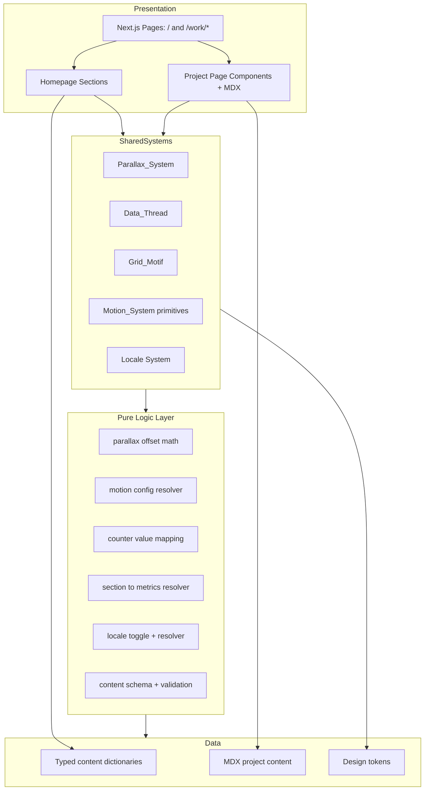

# Design Document

## Overview

This document describes the technical design for the personal brand and portfolio website of Yiheng Liu (刘一恒), positioned as an AI Product Manager for hardware-AI integration and multi-agent coordination. The site presents the **"quixoticmaker"** lowercase wordmark as its brand identity, reserving the real name "Yiheng Liu" for the footer sign-off. The site is a bilingual (Chinese / English) **hybrid**: one long-scroll narrative Homepage at the root plus three dedicated statically-generated Project_Pages at `/work/jarvis`, `/work/my-heart`, and `/work/arf`.

The design realizes an **"Engineering Editorial · Light"** visual system — a precisely typeset engineering-journal / architecture-studio portfolio that deliberately avoids any generic "AI aesthetic" (no purple/blue gradients, glowing orbs, glassmorphism, neon, or particle flow). Immersion is delivered through four cooperating systems:

- **Parallax_System** — a 2.5D depth-layering effect (3–4 CSS-transform layers, 4–12px pointer offsets, paper texture, no WebGL).
- **Grid_Motif** — a visible baseline grid with monospace coordinate/page-number marginalia and align-into-place element entry.
- **Data_Thread** — a site-wide guiding motif rendering the user's real project parameters as monospace amber margin readouts on top of the Grid_Motif, switching to the active project's real metrics as the visitor scrolls into each project's context.
- **Motion_System** — shared motion primitives (400–600ms transitions, 50–100ms staggered entry, align-not-fade, no scroll-jacking, full reduced-motion degradation).

The site is built with **Next.js (App Router, static export)**, content authored in **MDX** for Project_Pages, animated with **Framer Motion**, and styled with **Tailwind CSS**. It deploys on **Vercel** from **GitHub** with a custom domain, automatic HTTPS, CDN, and auto-deploy on push.

### Design Goals

1. **Credibility over flash.** Every visual choice reinforces engineering rigor; content argues through facts and architecture decisions in a calm, precise tone (no hype terms).
2. **Reading is never slowed.** Motion serves the narrative; scrolling is never hijacked and animations yield to scroll.
3. **Bilingual parity.** Every piece of primary content exists in both Chinese and English and switches consistently site-wide.
4. **Accessible by default.** A single reduced-motion path degrades all animation to fades/static while preserving all content.
5. **Fast, static, cheap.** Fully static generation, CDN-served, on Vercel's free tier.

### Key Design Decisions

| Decision | Choice | Rationale |
| --- | --- | --- |
| Rendering model | Next.js App Router with `output: 'export'` (SSG) | Req 22 mandates static generation; no server runtime needed; ideal for Vercel CDN. |
| Content format | Typed TS content modules (Homepage) + MDX (Project_Pages) | Req 22.3 mandates MDX for project pages; Homepage content is structured data better modeled as typed objects. |
| Brand identity | Lowercase "quixoticmaker" wordmark as site title + tab title; real name only in footer sign-off | Req 1.6–1.9, 17.1 make the wordmark the brand; the real name is reserved so the founder can match brand to person. |
| Animation | Framer Motion | Declarative, supports `useReducedMotion`, scroll-linked values (`useScroll`/`useTransform`), and staggered entry via variants — matches Motion_System needs. |
| Depth / parallax | CSS transforms on layered DOM, driven by pointer + scroll | Req 5.5 forbids WebGL; transform-only keeps it GPU-cheap and degradable. |
| Data Threads guide | Monospace amber margin readouts on the Grid_Motif, section→metrics resolved by a pure mapping from scroll context | Req 6.1–6.3 anchor the narrative in real metrics; a pure resolver keeps the section→metrics mapping deterministic and testable. |
| Styling | Tailwind CSS + CSS custom properties for the palette/tokens | Enforces the constrained token set (Req 8/9) and keeps the palette centralized. |
| i18n | Custom lightweight locale context (no heavy i18n runtime) | Static bilingual content only needs a locale switch + typed dictionaries; avoids routing complexity for a two-language static site. |

## Architecture

### System Context

The website is a purely client-rendered-after-static-build front-end with no backend services. All content is compiled at build time. The only runtime interactions are in-browser (scroll, pointer, locale toggle, navigation) and outbound links (GitHub / LinkedIn / Email).


### Application Architecture

The app is layered so that pure logic (testable) is separated from presentation (visual/animation):



**Layering principle:** All numeric/decision logic that governs motion and localization (offset clamping, stagger delays, counter interpolation, locale resolution, content completeness) lives in pure, framework-free modules under `lib/`. Components consume these via hooks. This makes the parts of the system that vary meaningfully with input independently unit- and property-testable, while the inherently visual parts (layout, rendering, texture) are covered by example/snapshot tests.

### Rendering & Motion Pipeline

1. **Build time:** Next.js statically generates `/`, `/work/jarvis`, `/work/my-heart`, `/work/arf`. MDX is compiled to React components. Content dictionaries are bundled.
2. **First paint:** Loading_Animation plays (line-scan / calibration style, amber on paper, 800–1200ms): it first establishes the coordinate Grid_Motif, then rapidly counts/calibrates the key real Data_Thread parameters from initial to final values with a mechanical odometer feel while fonts and the Hero layer prepare, then reveals Hero_Section on completion. It excludes AI-aesthetic elements (pulsing glowing dots, shimmer skeletons, gradient progress rings, breathing glow orbs) and degrades to a simple fade under reduced motion (Req 4, 9).
3. **Interaction:** A single top-level `MotionProvider` reads `prefers-reduced-motion` once and exposes it via context. Every animated component asks the Motion_System for its resolved config, so reduced-motion is enforced in one place.
4. **Scroll:** A global scroll-progress value (Framer Motion `useScroll`) drives the Parallax_System scroll offsets and the Data_Thread active-parameter switching (the margin readouts swap to the project whose section is in context). Pointer movement drives the parallax pointer offsets. Neither ever prevents native scrolling.

## Components and Interfaces

### Project / File Structure

```text
/
├─ app/
│  ├─ layout.tsx                 # Root layout: fonts, MotionProvider, LocaleProvider, grid stage, Header (wordmark), tab title = "quixoticmaker"
│  ├─ page.tsx                   # Homepage (assembles sections in order)
│  ├─ work/
│  │  ├─ jarvis/page.tsx         # imports jarvis.mdx into ProjectPage shell
│  │  ├─ my-heart/page.tsx
│  │  └─ arf/page.tsx
│  └─ globals.css                # Tailwind base + CSS custom properties (tokens)
├─ components/
│  ├─ sections/                  # Homepage sections
│  │  ├─ LoadingAnimation.tsx
│  │  ├─ Header.tsx              # wordmark (top-left) + bilingual sub-positioning tagline
│  │  ├─ HeroSection.tsx
│  │  ├─ SystemDiagram.tsx
│  │  ├─ DataAnchorSection.tsx
│  │  ├─ ProjectCard.tsx
│  │  ├─ ExperienceSection.tsx
│  │  ├─ PhilosophySection.tsx
│  │  └─ FooterSection.tsx
│  ├─ project/                   # Project_Page building blocks
│  │  ├─ ProjectPage.tsx         # shared shell + back-to-home control
│  │  ├─ ProjectHeader.tsx
│  │  ├─ MetricGrid.tsx
│  │  ├─ TechStackList.tsx
│  │  ├─ OscilloscopeMotif.tsx   # My Heart signature motif
│  │  ├─ ExplodedViewMotif.tsx   # ARF signature motif
│  │  └─ AnnotationStamp.tsx
│  ├─ systems/                   # Shared immersion systems
│  │  ├─ ParallaxLayer.tsx
│  │  ├─ DataThreads.tsx         # real-metric margin readouts, scroll-switched per project
│  │  ├─ GridStage.tsx
│  │  ├─ MarginReadout.tsx
│  │  ├─ ChapterTransition.tsx
│  │  ├─ MechanicalCounter.tsx
│  │  └─ SharedElementLink.tsx
│  └─ ui/
│     ├─ LocaleToggle.tsx
│     └─ Bilingual.tsx           # renders zh/en pairing
├─ lib/                          # PURE LOGIC (framework-free, testable)
│  ├─ parallax.ts                # offset math + clamping
│  ├─ motion.ts                  # resolveMotion(config, reducedMotion)
│  ├─ counter.ts                 # counter value interpolation
│  ├─ dataThread.ts              # section context -> active project metric set (pure)
│  ├─ locale.ts                  # toggleLocale, resolveContent
│  └─ contentSchema.ts           # schema + validateContent
├─ content/
│  ├─ site.ts                    # hero, data anchors, experience, philosophy, footer (bilingual)
│  ├─ chapters.ts                # chapter-transition phrases
│  ├─ projects/
│  │  ├─ jarvis.mdx
│  │  ├─ my-heart.mdx
│  │  └─ arf.mdx
│  └─ projectsMeta.ts            # card previews, metrics, routes, motif assignment
├─ styles/tokens.css             # palette, type scale, spacing, grid
├─ public/textures/paper.png     # paper texture (parallax depth)
├─ next.config.mjs               # output: 'export', MDX config
├─ tailwind.config.ts
└─ tests/                        # unit + property tests
```

### Shared Systems

#### Locale System (`lib/locale.ts` + `LocaleProvider` + `Bilingual`)

- `Locale = 'zh' | 'en'`.
- `toggleLocale(l: Locale): Locale` — pure switch to the other language.
- `resolveContent<T>(entry: Bilingual<T>, locale: Locale): T` — returns the field for the active locale.
- `LocaleProvider` holds current locale in React context and persists choice to `localStorage`.
- The `Bilingual` component renders paired zh/en content where editorial pairing is required (Req 3.5), and single-locale content elsewhere driven by the active `Locale`.
- Locale change applies globally because every consumer reads the same context (Req 3.4).

Interface:

```ts
type Bilingual<T = string> = { zh: T; en: T };
function toggleLocale(current: Locale): Locale;
function resolveContent<T>(entry: Bilingual<T>, locale: Locale): T;
```

#### Parallax_System (`lib/parallax.ts` + `ParallaxLayer`)

- Content is organized into 3–4 named depth layers with an ordered depth index: `background` (grid, slowest) → `mid` → `foreground` (body/annotations, tracks pointer most).
- `layerOffset(pointer, depthIndex, maxDepth)` returns a `{x, y}` translation whose magnitude is monotonically increasing with depth and always clamped to the **[4, 12] px** band per Req 5.3 (background near 4px, foreground near 12px).
- `scrollOffset(scrollProgress, depthIndex, maxDepth)` returns a layered vertical parallax translation, again ordered so background moves least.
- `ParallaxLayer` applies the computed offset via `transform: translate3d(...)` only.
- When reduced motion is active, both functions return zero offset (Req 5.6), and `ParallaxLayer` renders statically.

Interface:

```ts
interface Vec2 { x: number; y: number; }
function layerOffset(pointer: Vec2, depthIndex: number, maxDepth: number, reduced: boolean): Vec2;
function scrollOffset(progress: number, depthIndex: number, maxDepth: number, reduced: boolean): Vec2;
```

#### Data_Thread (`DataThreads` + `lib/dataThread.ts`)

- The site-wide guiding motif: real project parameters rendered as monospace margin readouts, layered on top of the Grid_Motif and sharing its amber accent styling (Req 6.1, 6.3, 7).
- Baseline readouts show the site's real technical parameters (e.g. "18 agents", "9600 baud", "1kHz", "P95<200ms", "H90,V120", "jitter<100μs").
- `activeMetrics(sectionContext)` (pure, in `lib/dataThread.ts`) maps the current scroll section/context deterministically to that project's real metric set: Jarvis → "P95<200ms", "18 agents"; My Heart → "9600 baud", "H90,V120"; ARF → "1kHz", "jitter<100μs" (Req 6.2). `DataThreads` observes global scroll progress and swaps the rendered parameters to `activeMetrics` for the section the visitor is entering.
- Reduced motion: the parameters render statically without scroll-driven switching animation while remaining readable (Req 6.6).

#### Grid_Motif (`GridStage` + `MarginReadout`)

- `GridStage` renders the baseline grid using `--color-grid (#E5E2DC)` as the layout stage behind all content (Req 7.1).
- Section elements animate **into grid alignment** on entry (align-into-place, shared with Motion_System) (Req 7.2).
- `MarginReadout` prints monospace coordinate / page-number / column-number readouts in the page margins, rendered in `--color-accent` amber (Req 7.3, 7.4).

#### Motion_System (`lib/motion.ts` + `MotionProvider`)

- Central config resolver: `resolveMotion(intent, reduced)` maps a semantic motion intent (e.g. `sectionEnter`, `stagger`, `counter`, `parallax`, `dataThread`, `sharedElement`) to concrete Framer Motion transition props.
- Non-reduced defaults: duration 400–600ms, staggered children 50–100ms, easing that "aligns into place" (spring/ease-out from a small offset, not a plain opacity fade) (Req 20.1, 20.2).
- Reduced defaults: every intent collapses to a simple opacity fade or an instant static state (Req 21.2).
- Scroll never locks; animations are declared so scroll interrupts them (`whileInView` with `viewport={{ once: true }}` and no scroll capture) (Req 20.3, 20.4).

Interface:

```ts
type MotionIntent = 'sectionEnter' | 'stagger' | 'counter' | 'parallax' | 'dataThread' | 'sharedElement' | 'loading';
interface ResolvedMotion { durationMs: number; staggerMs?: number; kind: 'align' | 'fade' | 'static'; }
function resolveMotion(intent: MotionIntent, reduced: boolean): ResolvedMotion;
```

#### MechanicalCounter (`MechanicalCounter` + `lib/counter.ts`)

- `counterValue(target, progress)` maps animation progress (0→1) to a displayed value, monotonic non-decreasing, ending exactly at `target` (Req 11.4).
- Rendered as split-flap / odometer digits in monospace; triggered when the number enters the viewport.
- Reduced motion: renders `target` immediately as static text (Req 11.5).

#### SharedElementLink (`SharedElementLink`)

- Wraps a Project_Card as a navigation trigger to its Project_Page, using Framer Motion `layoutId` shared-element transition to visually connect card → page (Req 18.1).
- Reduced motion: degrades to a simple fade navigation (Req 18.4).

### Header / Wordmark

The persistent `Header` renders the lowercase Wordmark "quixoticmaker" in the top-left, accompanied by the bilingual sub-positioning tagline ("AI PM · Hardware-AI Integration" in English Language_Mode, "软硬一体 · 多智能体协同" in Chinese Language_Mode) and the `LocaleToggle` (Req 1.6–1.9). The Wordmark — not the personal name — is the site brand name and is also set as the browser tab title via the root layout metadata (Req 1.6, 1.8). The real name "Yiheng Liu" appears only in the Footer sign-off.

### Homepage Sections (in required order — Req 2.3)

1. **LoadingAnimation** — establishes the coordinate Grid_Motif, then rapidly counts/calibrates the key real Data_Thread parameters from initial to final values with a mechanical odometer feel (line-scan / calibration style, not a spinner), amber on off-white paper, 800–1200ms, then reveals Hero on completion; excludes AI-aesthetic elements (pulsing glowing dots, shimmer skeletons, gradient progress rings, breathing glow orbs) per Req 9, and degrades to a simple fade under reduced motion (Req 4, 9).
2. **HeroSection** — positioning statement (AI PM for hardware-AI integration & multi-agent coordination; full-stack product definition spanning algorithm boundaries → hardware protocols → UX), plus `SystemDiagram` (semantic → decoupling → action, boxes + connectors + monospace protocol annotations, animated data dot) (Req 1, 10).
3. **DataAnchorSection** — ~5 headline numbers (monospace) with bilingual labels and mechanical counters (Req 11).
4. **ProjectCard ×3** — Jarvis, My Heart, ARF previews; hover reveals ≥2 key metrics; activates shared-element navigation (Req 2.4, 2.6, 18).
5. **ExperienceSection** — parallel peer entries in a side-by-side two-column card/panel layout with no time axis and no chronological ordering: BAAI internship (LLM capability boundaries; Robocoin, RoboxStudio) and competition team lead (创赛挑杯, Robocon) presented as equal-weight peer items (Req 15).
6. **PhilosophySection** — Vibecoding, AI-Native / Agentic UX / Generative UI, "Breathing Room", redefinition of "Skill" (Req 16).
7. **FooterSection** — the "quixoticmaker — Yiheng Liu" signature sign-off (the only place the real name appears), AI PM positioning, and GitHub/LinkedIn/Email links with gray→amber hover (Req 17).

Chapter_Transition phrases are interleaved between sections in the fixed sequence: Hero「从理解语义开始…」→ Jarvis「…到调度智能体…」→ My Heart「…再到驱动物理世界…」→ ARF「…最终，统一所有机器人。」(Req 6.5, 6.6).

### Project_Pages

Each Project_Page uses the shared `ProjectPage` shell (same Visual_System, Req 18.3), a back-to-Homepage control (Req 2.5), MDX body content (Req 22.3), and receives the shared-element transition target. Content is the full technical documentation from Requirements 12 (Jarvis), 13 (My Heart), 14 (ARF). Signature motifs: My Heart → `OscilloscopeMotif` (VAD/RMS waveform), ARF → `ExplodedViewMotif` (layered architecture); numeric values in motifs rendered monospace; annotation/stamp styling for credibility (Req 19).

## Data Models

### Design Tokens (`styles/tokens.css`)

```css
:root {
  --color-paper:   #F5F3EE;  /* warm off-white background */
  --color-ink:     #1C1C1C;  /* primary text */
  --color-gray:    #6B6B6B;  /* secondary text */
  --color-accent:  #D97706;  /* single amber accent, used sparingly */
  --color-grid:    #E5E2DC;  /* near-invisible grid lines */
  /* three font weights only */
  --fw-light: 300; --fw-regular: 400; --fw-bold: 700;
  --font-display: /* grotesque or serif, NOT Inter */;
  --font-body-en: /* clean sans */;
  --font-mono:    /* monospace: numbers, annotations, protocol frames */;
  --font-zh:      /* Source Han Sans / Source Han Serif */;
}
```

Hierarchy is created through size + whitespace, not color variation (Req 8.8). The palette is the sole allowed color set (Req 9.4).

### Bilingual Content Model

```ts
type Locale = 'zh' | 'en';
type Bilingual<T = string> = { zh: T; en: T };

interface HeadlineNumber {
  value: number;           // rendered by the mechanical counter
  suffix?: string;         // e.g. "ms", "<"
  label: Bilingual;        // bilingual caption
}

interface ExperienceEntry {
  title: Bilingual;
  detail: Bilingual;
}

interface ChapterPhrase { zh: string; en: string; }

interface ContactLink { kind: 'github' | 'linkedin' | 'email'; href: string; }

interface SiteBranding {
  wordmark: string;              // "quixoticmaker" — brand name / tab title (Req 1.6–1.8)
  tagline: Bilingual;            // sub-positioning: en "AI PM · Hardware-AI Integration", zh "软硬一体 · 多智能体协同" (Req 1.9)
  signature: string;             // footer sign-off "quixoticmaker — Yiheng Liu" (Req 17.1)
}

interface SiteContent {
  branding: SiteBranding;        // wordmark, tagline, signature (Req 1.6–1.9, 17.1)
  hero: {
    positioning: Bilingual;      // Req 1.1
    capability: Bilingual;       // Req 1.2 full-stack statement
    subtitle: Bilingual;
  };
  dataAnchors: HeadlineNumber[]; // ~5 (Req 11.1)
  experience: ExperienceEntry[]; // parallel peer items, unordered (Req 15)
  philosophy: {
    vibecoding: Bilingual;
    aiNative: Bilingual;
    breathingRoom: Bilingual;
    skillRedefinition: Bilingual;
  };
  footer: { signature: string; positioning: Bilingual; links: ContactLink[]; }; // "quixoticmaker — Yiheng Liu" (Req 17.1)
  chapters: ChapterPhrase[];     // ordered (Req 6.6)
}
```

### Project Metadata & MDX

```ts
type ProjectId = 'jarvis' | 'my-heart' | 'arf';

interface ProjectMeta {
  id: ProjectId;
  route: `/work/${ProjectId}`;
  index: '01' | '02' | '03';
  name: Bilingual;
  tagline: Bilingual;
  techTags: string[];
  previewMetrics: { value: string; label: Bilingual }[]; // ≥2 (Req 2.6)
  signatureMotif?: 'oscilloscope' | 'exploded-view';     // My Heart / ARF
}
```

Project long-form content lives in MDX (`content/projects/*.mdx`) so the dense technical facts of Req 12/13/14 are authored as prose + embedded components (metric grids, diagrams, motifs), compiled statically at build.

### Motion / Parallax Value Model

```ts
interface Vec2 { x: number; y: number; }
interface DepthLayer { name: 'background' | 'mid' | 'foreground'; depthIndex: number; } // ordered
interface ResolvedMotion { durationMs: number; staggerMs?: number; kind: 'align' | 'fade' | 'static'; }
```

Invariants encoded by the logic layer:

- Parallax offset magnitude ∈ [4, 12] px and increases with depth index.
- Non-reduced transition duration ∈ [400, 600] ms; stagger ∈ [50, 100] ms.
- Loading duration ∈ [800, 1200] ms.
- Counter output is monotonic and terminates at the target.
- Reduced motion forces `kind` to `fade` or `static` and zeroes parallax offsets.

## Correctness Properties

*A property is a characteristic or behavior that should hold true across all valid executions of a system — essentially, a formal statement about what the system should do. Properties serve as the bridge between human-readable specifications and machine-verifiable correctness guarantees.*

Most of this feature is inherently visual (layout, texture, typography, motif rendering) and is covered by example/snapshot tests rather than property-based tests. However, the pure logic layer under `lib/` — parallax offset math, motion config resolution, counter interpolation, locale handling, and the Data_Thread section→metrics resolver — varies meaningfully with input and encodes universal invariants. The properties below target that layer.

### Property 1: Parallax offsets stay within the depth band

*For any* pointer position, depth index, and max depth (with reduced motion off), the magnitude of each axis of the offset returned by `layerOffset` is within the inclusive range [4, 12] pixels.
**Validates: Requirements 5.3**

### Property 2: Parallax offset magnitude increases with depth

*For any* two depth layers where layer A has a smaller depth index than layer B (same pointer and max depth, reduced motion off), the offset magnitude produced for the background-most layer is less than or equal to that of the foreground-most layer — the background moves least and the foreground tracks the pointer most.
**Validates: Requirements 5.2**

### Property 3: Reduced motion zeroes parallax

*For any* pointer position, scroll progress, and depth index, when reduced motion is active, both `layerOffset` and `scrollOffset` return a zero vector.
**Validates: Requirements 5.6, 21.2**

### Property 4: Non-reduced motion durations fall in the specified bands

*For any* motion intent, when reduced motion is off, `resolveMotion` returns a `durationMs` within the band required for that intent (section/element transitions 400–600ms; loading 800–1200ms) and, where a stagger applies, a `staggerMs` within 50–100ms.
**Validates: Requirements 20.1, 20.2, 4.4**

### Property 5: Reduced motion collapses every intent to fade or static

*For any* motion intent, when reduced motion is active, `resolveMotion` returns a `kind` of either `fade` or `static` (never `align`).
**Validates: Requirements 21.2, 4.6, 6.6, 11.5, 18.4, 19.5**

### Property 6: Counter output is monotonic and terminates at the target

*For any* target value and any non-decreasing sequence of progress values in [0, 1], `counterValue` produces a non-decreasing sequence of displayed values, and `counterValue(target, 1)` equals the target exactly.
**Validates: Requirements 11.4**

### Property 7: Locale toggle is an involution over two languages

*For any* locale, applying `toggleLocale` twice returns the original locale, and applying it once always returns the other supported language.
**Validates: Requirements 3.3**

### Property 8: Content resolution always yields the active-locale field

*For any* bilingual content entry and any locale, `resolveContent` returns exactly that locale's field, and for every primary content entry both the `zh` and `en` fields are present and non-empty (bilingual parity).
**Validates: Requirements 3.1, 3.4, 3.5**

### Property 9: Data_Thread maps each section context to its real metrics deterministically

*For any* section context, `activeMetrics` returns exactly the fixed real metric set defined for that context (Jarvis → "P95<200ms", "18 agents"; My Heart → "9600 baud", "H90,V120"; ARF → "1kHz", "jitter<100μs"), and repeated calls with the same context return the same set — the scroll-to-metrics mapping is a pure, deterministic function of section context.
**Validates: Requirements 6.2**

## Error Handling

Because the site is fully static with no backend, error handling centers on build-time content integrity, graceful runtime degradation, and safe outbound navigation.

### Build-Time

- **Content completeness check.** `validateContent` (from `lib/contentSchema.ts`) runs during build/test and fails the build if any primary content entry is missing its `zh` or `en` field, if `dataAnchors` count is outside the expected ~5, or if any `ProjectMeta.previewMetrics` has fewer than 2 entries (Req 2.6, 3.1, 11.1). This turns bilingual-parity and content contract violations into hard build failures rather than silent gaps.
- **MDX compilation errors.** A malformed MDX project file fails `next build`, preventing a broken Project_Page from shipping.
- **Route/asset integrity.** The three Project_Page routes and the paper texture asset are referenced from typed constants, so a missing route or asset surfaces as a type/build error.

### Runtime

- **Reduced-motion detection failure.** If `matchMedia` is unavailable, the Motion_System defaults to reduced motion (safest: static/fade), guaranteeing content is always readable (Req 21.3).
- **`localStorage` unavailable.** Locale persistence is wrapped in try/catch; on failure the site falls back to the default locale in-memory without breaking the toggle (Req 3.2, 3.3).
- **Pointer/scroll unavailable (touch, no hover).** Parallax pointer offsets simply resolve to zero when no pointer is present; scroll parallax and all content remain intact.
- **Image/texture load failure.** The paper texture is decorative; if it fails to load the paper background color still renders, preserving legibility.
- **Outbound links.** Contact links open their destinations (Req 17.4); external links use `rel="noopener noreferrer"` to avoid `window.opener` exposure.

### Degradation Ladder

1. Full experience: parallax + scroll-switched Data_Thread readouts + counters + staggered align-in.
2. Reduced motion: fades / static rendering of every animated system, all content present (Req 21.2, 21.3).
3. Mobile: stacked layouts, simplified motion, retained readability (Req 23).
4. Worst case (no JS animation, no texture): a fully readable, statically-generated bilingual document with the correct palette and typography.

## Testing Strategy

The feature combines a small, high-value **pure logic layer** (well suited to property-based testing) with a large **visual/interaction layer** (best served by example, snapshot, and interaction tests). The strategy uses both, matching each acceptance criterion to the cheapest test that meaningfully validates it.

### Tooling

- **Test runner:** Vitest.
- **Property-based testing:** `fast-check` (do not hand-roll generators/shrinking).
- **Component/interaction:** React Testing Library + jsdom.
- **Snapshot / visual:** Vitest snapshots for structural output; optional Playwright for visual regression of the Visual_System (palette, typography, grid).

### Property-Based Tests (pure logic layer)

Each correctness property maps to exactly one property-based test in `tests/`, configured to run **a minimum of 100 iterations**, and tagged with a comment in the form:

`// Feature: personal-brand-website, Property N: <property text>`

| Property | Target module | What is generated |
| --- | --- | --- |
| 1 Offset band | `lib/parallax.ts` | random pointer, depthIndex, maxDepth |
| 2 Depth ordering | `lib/parallax.ts` | random pointer + two ordered depth indices |
| 3 Reduced zeroes parallax | `lib/parallax.ts` | random pointer/scroll/depth |
| 4 Duration bands | `lib/motion.ts` | random motion intent |
| 5 Reduced fade/static | `lib/motion.ts` | random motion intent |
| 6 Counter monotonic/terminal | `lib/counter.ts` | random target + non-decreasing progress sequence |
| 7 Locale involution | `lib/locale.ts` | random locale |
| 8 Content resolution/parity | `lib/locale.ts` + content | random bilingual entries + locale |
| 9 Data_Thread section mapping | `lib/dataThread.ts` | random section context |

### Example / Unit Tests

- Loading_Animation reveals Hero on completion and uses line-scan/dot style, not a spinner (Req 4.2, 4.5).
- Hero_Section renders the positioning + full-stack capability statement and the box/connector/monospace SystemDiagram (Req 1, 10).
- Chapter_Transition phrases render in the exact required order and wording (Req 6.6).
- Data_Anchor renders ~5 monospace numbers with bilingual labels (Req 11.1–11.3).
- Project_Card hover reveals ≥2 metrics; activation triggers navigation to the correct route (Req 2.4, 2.6).
- Footer links point to GitHub/LinkedIn/Email and apply gray→amber hover (Req 17).
- Content authored text contains no hype terms (「颠覆」「革命性」「最」「唯一」) and no OPC content — a lint-style unit test over content dictionaries and MDX (Req 1.3, 1.5).

### Snapshot / Visual Tests

- Visual_System tokens: palette values and three-weight type system match the spec (Req 8, 9).
- SystemDiagram, OscilloscopeMotif, ExplodedViewMotif structural snapshots (Req 10, 19).
- Grid_Motif renders margin readouts in monospace/amber (Req 7.3, 7.4).
- Anti-AI-aesthetic guard: a token/style test asserting no gradient/neon/glass utilities are present (Req 9).

### Integration / Smoke Tests

- Static export produces `/`, `/work/jarvis`, `/work/my-heart`, `/work/arf` (Req 22.1, 22.2).
- Project_Pages compile from MDX (Req 22.3).
- Reduced-motion end-to-end: with `prefers-reduced-motion: reduce`, parallax/Data_Thread switching/counter/transitions render static/fade and all content is reachable (Req 21).
- Responsive: at mobile width, side-by-side layouts stack and content remains readable (Req 23).
- Deployment (manual/CI smoke): Vercel build from GitHub succeeds, serves over HTTPS on the custom domain via CDN, and redeploys on push (Req 24) — verified against the platform, not unit-tested.

### What is intentionally NOT property-tested

Parallax *rendering*, Data_Thread margin *rendering*, texture, typography, layout, and motif visuals are not amenable to "for all inputs" assertions; they are validated by snapshot/visual/interaction tests. Deployment (Req 24) is infrastructure verification handled by build/CI smoke checks. This keeps property tests focused on the logic that genuinely varies with input.
